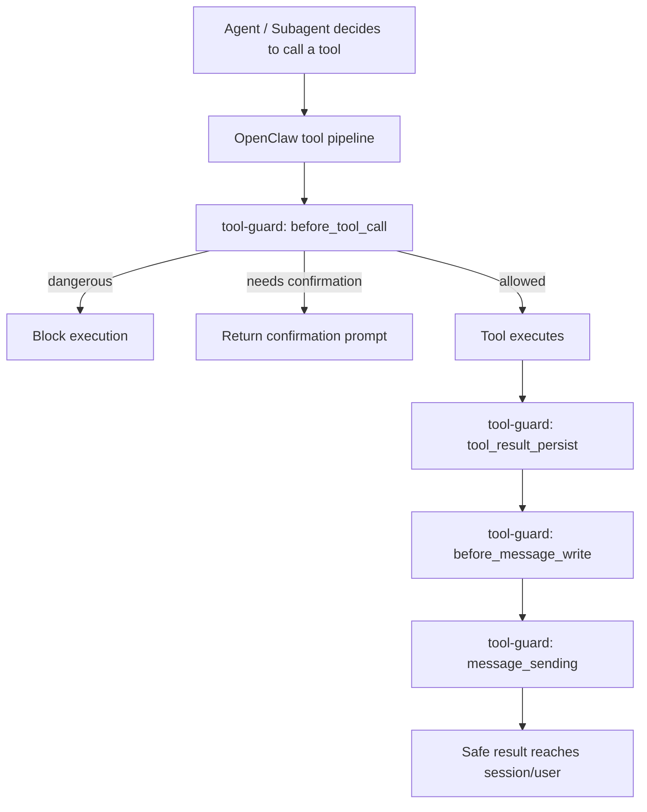

<h1 align="center">Tool Guard for Safe OpenClaw</h1>

<p align="center">
  Mechanism-level security guardrails for OpenClaw tool execution and content handling.
</p>

<p align="center">
  <a href="./README.md">English</a> |
  <a href="./README.zh-CN.md">Chinese</a>
</p>

<p align="center">
  <a href="https://github.com/shaokangW/tool-guard-plugins-for-safe-openclaw">Repository</a>
  |
  <a href="./docs/PUBLISHING.md">Publishing</a>
  |
  <a href="#one-click-install">Install</a>
  |
  <a href="#configuration-reference">Config</a>
</p>

<p align="center">
  
  
  
  
  
</p>

<p align="center">
  <strong>Block dangerous tool calls. Gate risky actions. Filter sensitive content.</strong>
</p>

`tool-guard` is an OpenClaw plugin that adds a hard security layer to the OpenClaw execution pipeline. Instead of relying only on prompts or skills, it hooks into tool-call and message-processing stages to enforce configurable rules for execution filtering, confirmation gating, output redaction, and outbound content moderation.

It is designed to be published as a standalone project and installed with a single command on Windows, macOS, or Linux.

## Quick Start

```bash
git clone https://github.com/shaokangW/tool-guard-plugins-for-safe-openclaw.git
cd tool-guard-plugins-for-safe-openclaw

# Windows
powershell -ExecutionPolicy Bypass -File .\scripts\install.ps1

# macOS / Linux
chmod +x ./scripts/install.sh
./scripts/install.sh
```

After installation:

1. `tool-guard` is registered in OpenClaw.
2. Rule files are connected from `examples/rules/`.
3. The gateway is validated and restarted.
4. Dangerous or sensitive tool activity starts being filtered immediately.

## Features

| Execution Guardrails | Content Guardrails | Operational Controls |
| --- | --- | --- |
| Block dangerous commands before they run | Detect sensitive content in tool input and output | External JSON rule loading for command and content policies |
| Require explicit confirmation for medium-risk actions | Replace unsafe tool results with safe fallback text | One-click install scripts for Windows, Linux, and macOS |
| Filter tool calls at the plugin hook layer instead of prompt-only guidance | Block unsafe messages before persistence or outbound delivery | Built-in self-protection for plugin modifications |
| Apply consistent execution policy across agent and subagent tool calls | Add a review layer for assistant responses leaving OpenClaw | Repo-friendly packaging for standalone publishing |

## Architecture



## What It Does

- Blocks dangerous shell commands before execution
- Blocks medium-risk commands and turns them into explicit confirmation actions
- Blocks commands that directly contain sensitive content
- Redacts sensitive tool output before it is persisted
- Blocks sensitive assistant messages from being written or sent outward
- Protects the plugin's own files from silent modification

## Hooks Used

- `before_tool_call`
- `tool_result_persist`
- `before_message_write`
- `message_sending`

## Project Layout

```text
tool-guard/
  index.ts
  openclaw.plugin.json
  package.json
  LICENSE
  README.md
  README.zh-CN.md
  examples/
    tool-guard.config.example.json
    rules/
      dangerous-commands.json
      warning-commands.json
      sensitive-content.json
  scripts/
    install.ps1
    install.sh
    uninstall.ps1
    uninstall.sh
```

## One-Click Install

From inside the project directory:

Windows:

```powershell
powershell -ExecutionPolicy Bypass -File .\scripts\install.ps1
```

macOS / Linux:

```bash
chmod +x ./scripts/install.sh
./scripts/install.sh
```

What the installer does:

- installs the plugin via `openclaw plugins install -l`
- updates `~/.openclaw/openclaw.json`
- points the plugin config at the bundled rule JSON files
- enables the plugin
- validates OpenClaw config
- restarts the local gateway

## Uninstall

Windows:

```powershell
powershell -ExecutionPolicy Bypass -File .\scripts\uninstall.ps1
```

macOS / Linux:

```bash
chmod +x ./scripts/uninstall.sh
./scripts/uninstall.sh
```

## Manual Install

```bash
openclaw plugins install -l /path/to/tool-guard
openclaw plugins enable tool-guard
```

Then add config like this:

```json
{
  "plugins": {
    "allow": ["tool-guard"],
    "load": {
      "paths": ["/path/to/tool-guard"]
    },
    "entries": {
      "tool-guard": {
        "enabled": true,
        "config": {
          "blockedCommandRulesFile": "/path/to/tool-guard/examples/rules/dangerous-commands.json",
          "confirmCommandRulesFile": "/path/to/tool-guard/examples/rules/warning-commands.json",
          "sensitiveContentRulesFile": "/path/to/tool-guard/examples/rules/sensitive-content.json",
          "blockedCommandSubstrings": [
            "rm -rf",
            "del /f /s /q",
            "remove-item -recurse -force"
          ],
          "blockMessageWrites": true,
          "blockMessageSending": true,
          "redactToolResults": true,
          "confirmTtlMs": 600000
        }
      }
    }
  }
}
```

## External JSON Rules

The plugin can load rules from external JSON files.

Supported file shapes:

- `blockedCommandRulesFile`
  Reads `{ "commands": ["regex1", "regex2"] }`
- `confirmCommandRulesFile`
  Reads `{ "commands": ["regex1", "regex2"] }`
- `sensitiveContentRulesFile`
  Reads either:
  - `{ "patterns": ["regex1", "regex2"] }`
  - `["regex1", "regex2"]`

Bundled examples:

- [dangerous-commands.json](./examples/rules/dangerous-commands.json)
- [warning-commands.json](./examples/rules/warning-commands.json)
- [sensitive-content.json](./examples/rules/sensitive-content.json)

## Confirmation Flow

When a command matches a confirmation rule, `tool-guard` blocks execution and
returns a tokenized confirmation prompt.

Example:

```text
/toolguard-confirm <token>
/toolguard-deny <token>
```

Notes:

- These are plugin commands for OpenClaw chat/native command surfaces
- They are not exposed through `openclaw agent --message ...`
- Tokens expire after `confirmTtlMs`
- By default, edits to the `tool-guard` project itself also require confirmation

## Configuration Reference

- `blockedCommandSubstrings`: simple case-insensitive fragments
- `blockedCommandPatterns`: regex rules merged with defaults and external file rules
- `confirmCommandPatterns`: regex rules that require confirmation
- `blockedCommandRulesFile`: external JSON for hard-block rules
- `confirmCommandRulesFile`: external JSON for confirmation rules
- `sensitiveContentPatterns`: regex rules for sensitive content
- `sensitiveContentRulesFile`: external JSON for sensitive-content rules
- `blockedPathPrefixes`: optional extra protected paths beyond the built-in plugin self-protection
- `protectedPathTools`: tools that should receive path checks
- `execTools`: tools treated as command-execution tools
- `pathParamNames`: parameter names that should be treated as paths
- `blockMessageWrites`: block sensitive content from being written to sessions
- `blockMessageSending`: block sensitive outbound content
- `redactToolResults`: redact sensitive tool output
- `confirmTtlMs`: confirmation token TTL in milliseconds
- `allowSelfModification`: disable the built-in self-protection layer for plugin files

## Why Not Prompt-Only Safety?

Prompt rules and skills are useful, but they are still model-facing guidance. They can be weakened by context loss, incomplete inheritance in subagent flows, prompt drift, or tool-use chains that do not preserve every instruction exactly as intended.

`tool-guard` is designed to sit below that layer. Instead of only telling the model what it should do, it enforces what the runtime is allowed to do. That makes it a better fit for high-risk operations, repeatable governance, and OpenClaw deployments where you want the same safety boundary to apply across normal agent runs, subagents, and automated workflows.

## Publish Notes

This project is ready to be published as a package or shared as a repo.

Detailed release notes:

- [PUBLISHING.md](./docs/PUBLISHING.md)

Recommended release flow:

1. Commit the project as its own repository
2. Tag releases by version from `package.json`
3. Publish the repo or package
4. Tell users to clone or download the project
5. Run the platform installer from `scripts/`

If you later want npm-based distribution, keep `index.ts`, `openclaw.plugin.json`,
and the `openclaw.extensions` field in `package.json`.

## Local Verification

Useful commands:

```bash
openclaw config validate
openclaw plugins list
openclaw agent --to +8613800000000 --message "Use the exec tool to run exactly this command and report the tool result: rm -rf /tmp/demo" --thinking off --timeout 120 --json
```

## Known Limits

- Plugin commands are intended for real chat/native command surfaces, not the `openclaw agent --message ...` local test path
- Confirmation resume currently executes the saved command directly from the plugin command handler rather than restoring the original model turn
- Regex rule systems can still produce false positives or false negatives
