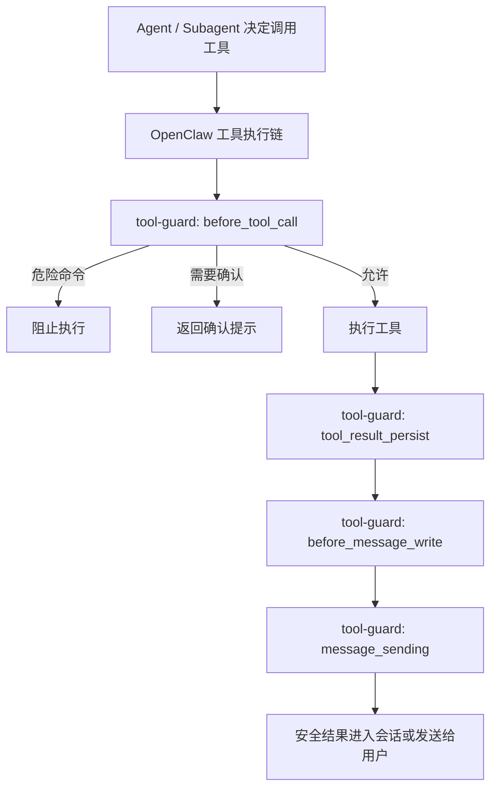

<h1 align="center">Tool Guard for Safe OpenClaw</h1>

<p align="center">
  面向 OpenClaw 的机制层安全防护插件，专注于工具执行过滤与内容审查。
</p>

<p align="center">
  <a href="./README.md">English</a> |
  <a href="./README.zh-CN.md">Chinese</a>
</p>

<p align="center">
  <a href="https://github.com/shaokangW/tool-guard-plugins-for-safe-openclaw">Repository</a>
  |
  <a href="./docs/PUBLISHING.md">Publishing</a>
  |
  <a href="#一键安装">Install</a>
  |
  <a href="#配置说明">Config</a>
</p>

<p align="center">
  
  
  
  
  
</p>

<p align="center">
  <strong>拦截危险工具调用，门控高风险操作，过滤敏感内容。</strong>
</p>

`tool-guard` 是一个 OpenClaw 安全插件。它不是只依赖 prompt 或 skill 让模型尽量遵守规则，而是直接接入 OpenClaw 的工具调用与消息处理链路，在执行前、结果持久化前、消息发送前提供一层可配置、可审计的安全防护。

它适合为 OpenClaw 提供机制层护栏，包括高风险命令拦截、需要确认的操作门控、灵活的工具执行过滤、敏感内容检测、工具结果脱敏，以及回复内容的审查过滤。相比只依赖 prompt 或 skill，`tool-guard` 更适合作为硬约束层，尤其适用于 subagent、多工具协作和自动化执行场景。

## Quick Start

```bash
git clone https://github.com/shaokangW/tool-guard-plugins-for-safe-openclaw.git
cd tool-guard-plugins-for-safe-openclaw

# Windows
powershell -ExecutionPolicy Bypass -File .\scripts\install.ps1

# macOS / Linux
chmod +x ./scripts/install.sh
./scripts/install.sh
```

安装完成后：

1. `tool-guard` 会被注册到 OpenClaw。
2. `examples/rules/` 中的规则文件会自动接入配置。
3. gateway 会被校验并重启。
4. 危险或敏感的工具行为会立刻开始被过滤。

## Features

| 执行防护 | 内容防护 | 运维能力 |
| --- | --- | --- |
| 在命令真正执行前拦截危险操作 | 检测工具输入输出中的敏感内容 | 支持通过外部 JSON 加载命令和内容规则 |
| 对中风险操作要求显式确认 | 将不安全的工具结果替换为安全提示 | 提供 Windows、Linux、macOS 一键安装脚本 |
| 在插件 hook 层做硬约束，而不是只靠 prompt | 在消息落盘和外发前增加审查层 | 默认保护插件自身文件，避免静默篡改 |
| 对 agent 和 subagent 的工具调用提供一致的过滤逻辑 | 对 assistant 回复增加离开 OpenClaw 前的审查 | 适合作为可独立发布的仓库或插件项目 |

## Architecture



## 核心能力

- 在执行前拦截危险 shell 命令
- 将中风险命令转为显式确认流程
- 检查命令参数中的敏感内容
- 在工具结果落盘前做脱敏替换
- 在消息写入或对外发送前做内容审查
- 默认保护插件自身目录，避免被静默篡改

## 使用的 Hook

- `before_tool_call`
- `tool_result_persist`
- `before_message_write`
- `message_sending`

## 项目结构

```text
tool-guard/
  index.ts
  openclaw.plugin.json
  package.json
  LICENSE
  README.md
  README.zh-CN.md
  examples/
    tool-guard.config.example.json
    rules/
      dangerous-commands.json
      warning-commands.json
      sensitive-content.json
  scripts/
    install.ps1
    install.sh
    uninstall.ps1
    uninstall.sh
```

## 一键安装

在项目目录内执行：

Windows:

```powershell
powershell -ExecutionPolicy Bypass -File .\scripts\install.ps1
```

macOS / Linux:

```bash
chmod +x ./scripts/install.sh
./scripts/install.sh
```

安装脚本会自动：

- 通过 `openclaw plugins install -l` 注册插件
- 更新 `~/.openclaw/openclaw.json`
- 将插件配置指向项目自带的规则 JSON
- 启用插件
- 校验 OpenClaw 配置
- 重启本地 gateway

## 卸载

Windows:

```powershell
powershell -ExecutionPolicy Bypass -File .\scripts\uninstall.ps1
```

macOS / Linux:

```bash
chmod +x ./scripts/uninstall.sh
./scripts/uninstall.sh
```

## 手动安装

```bash
openclaw plugins install -l /path/to/tool-guard
openclaw plugins enable tool-guard
```

然后在 `openclaw.json` 中增加类似配置：

```json
{
  "plugins": {
    "allow": ["tool-guard"],
    "load": {
      "paths": ["/path/to/tool-guard"]
    },
    "entries": {
      "tool-guard": {
        "enabled": true,
        "config": {
          "blockedCommandRulesFile": "/path/to/tool-guard/examples/rules/dangerous-commands.json",
          "confirmCommandRulesFile": "/path/to/tool-guard/examples/rules/warning-commands.json",
          "sensitiveContentRulesFile": "/path/to/tool-guard/examples/rules/sensitive-content.json",
          "blockedCommandSubstrings": [
            "rm -rf",
            "del /f /s /q",
            "remove-item -recurse -force"
          ],
          "blockMessageWrites": true,
          "blockMessageSending": true,
          "redactToolResults": true,
          "confirmTtlMs": 600000
        }
      }
    }
  }
}
```

## 外部 JSON 规则

插件支持从外部 JSON 加载规则。

支持的格式：

- `blockedCommandRulesFile`
  读取 `{ "commands": ["regex1", "regex2"] }`
- `confirmCommandRulesFile`
  读取 `{ "commands": ["regex1", "regex2"] }`
- `sensitiveContentRulesFile`
  读取以下任一格式：
  - `{ "patterns": ["regex1", "regex2"] }`
  - `["regex1", "regex2"]`

示例规则文件：

- [dangerous-commands.json](./examples/rules/dangerous-commands.json)
- [warning-commands.json](./examples/rules/warning-commands.json)
- [sensitive-content.json](./examples/rules/sensitive-content.json)

## 确认流程

当命令命中确认规则时，`tool-guard` 会阻止立即执行，并返回一个带 token 的确认提示。

示例：

```text
/toolguard-confirm <token>
/toolguard-deny <token>
```

说明：

- 这是 OpenClaw 聊天或原生命令界面里的插件命令
- 不会通过 `openclaw agent --message ...` 直接暴露
- token 会在 `confirmTtlMs` 后过期
- 默认情况下，修改 `tool-guard` 自身文件也需要先确认

## 配置说明

- `blockedCommandSubstrings`: 简单的大小写不敏感片段匹配
- `blockedCommandPatterns`: 正则规则，会与默认规则和外部规则合并
- `confirmCommandPatterns`: 命中后需要确认的正则规则
- `blockedCommandRulesFile`: 外部硬拦截规则 JSON
- `confirmCommandRulesFile`: 外部确认规则 JSON
- `sensitiveContentPatterns`: 敏感内容正则规则
- `sensitiveContentRulesFile`: 外部敏感内容规则 JSON
- `blockedPathPrefixes`: 在插件自保护之外额外附加的受保护路径
- `protectedPathTools`: 需要做路径检查的工具名
- `execTools`: 被视为命令执行工具的工具名
- `pathParamNames`: 需要按路径参数处理的字段名
- `blockMessageWrites`: 是否阻止敏感内容写入会话
- `blockMessageSending`: 是否阻止敏感内容向外发送
- `redactToolResults`: 是否对敏感工具输出做脱敏
- `confirmTtlMs`: 确认 token 的过期时间
- `allowSelfModification`: 是否关闭插件自身文件的默认保护

## Why not prompt-only safety?

只靠 prompt 或 skill 做安全约束是有帮助的，但它本质上仍然是“给模型看的规则”。一旦发生上下文裁剪、subagent 继承不完整、提示词漂移，或者多工具链路没有完整保留这些指令，安全约束就可能变弱。

`tool-guard` 的定位是在更底层的机制层直接接管这一部分。它不是只告诉模型“应该怎么做”，而是直接限制运行时“允许做什么”。这让它更适合承担高风险操作的硬约束，也更适合需要统一安全边界的 OpenClaw 部署场景，包括普通 agent、subagent 和自动化工作流。

## 发布说明

这个项目已经适合独立作为仓库或包发布。

详细说明：

- [PUBLISHING.md](./docs/PUBLISHING.md)

推荐流程：

1. 作为独立仓库维护
2. 按 `package.json` 版本打 tag
3. 发布仓库或包
4. 让用户 clone 或下载项目
5. 通过 `scripts/` 下的安装脚本完成部署

## 本地验证

常用命令：

```bash
openclaw config validate
openclaw plugins list
openclaw agent --to +8613800000000 --message "Use the exec tool to run exactly this command and report the tool result: rm -rf /tmp/demo" --thinking off --timeout 120 --json
```

## 已知限制

- 插件命令主要面向真实聊天或原生命令界面，不是 `openclaw agent --message ...` 本地测试路径
- 确认后的恢复执行目前是插件命令直接重放，不是恢复原始模型轮次
- 正则规则体系仍然可能存在误报或漏报
